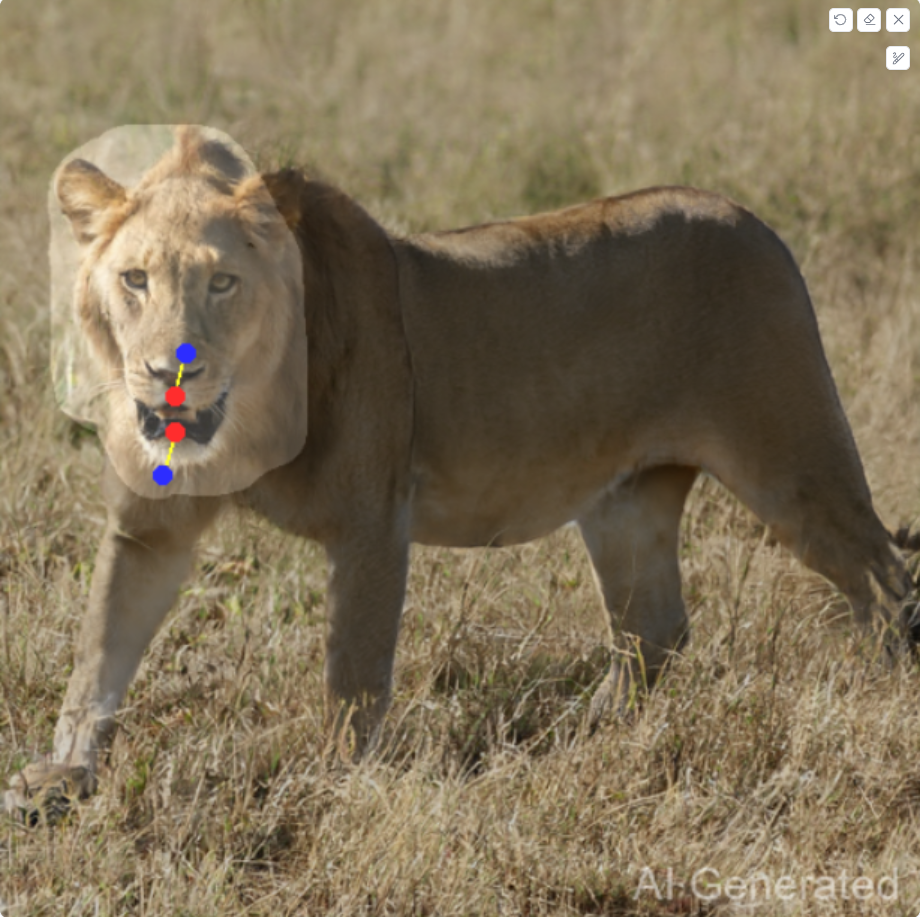
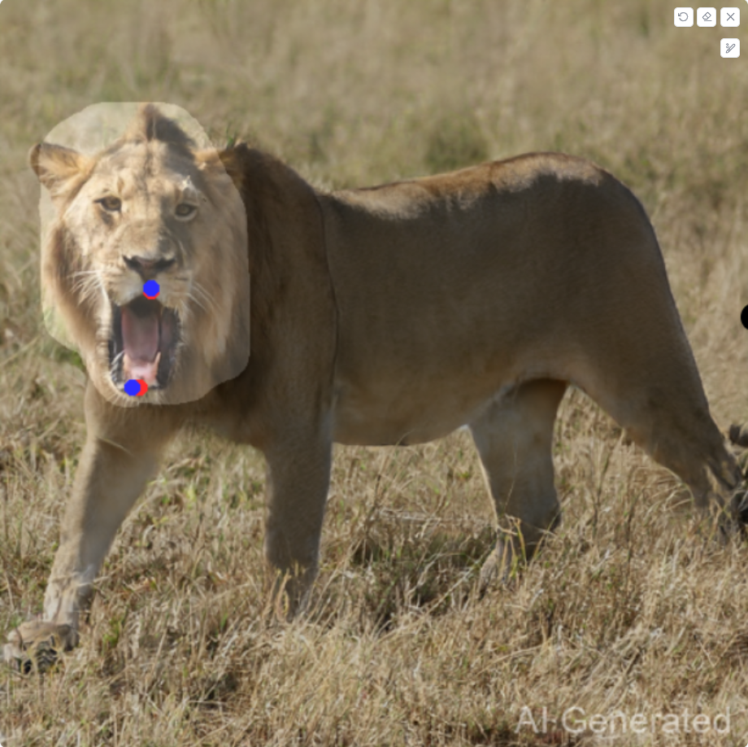
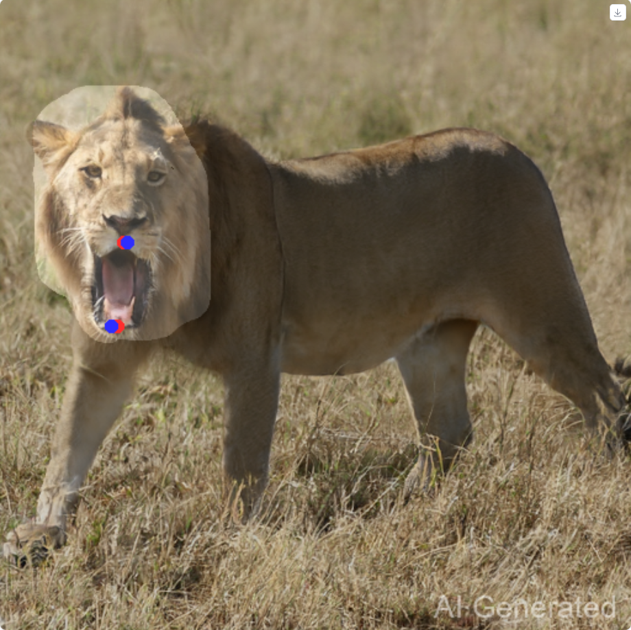

## 1. 改进动机 (Motivation)
在标准的 DragGAN 实现中，为了驱动控制点移动而优化潜在代码（Latent Code, $w$）往往会引发整个图像的全局变化。当用户仅希望操控特定的感兴趣区域（Region of Interest, ROI）而保持背景或其他物体静止时，这种全局副作用是不可接受的。虽然传统的掩码损失（$L_{mask}$）试图惩罚背景的变化，但在长距离拖拽或高频优化过程中，背景仍容易出现纹理退化、漂移或不自然的扭曲。

## 2. 改进方案：软特征融合 (Soft Feature Blending)
为了解决生成过程中的稳定性问题，我们引入了一个**特征融合模块（Feature Blending Module）**。该机制在图像空间和特征空间双重维度上工作，通过用户定义的二值掩码（Mask）和混合比例（Blend Ratio），在“当前生成状态”与“原始状态”之间进行动态插值。

### 方法论
渲染管线被修改为在非掩码区域（背景）执行线性插值。混合逻辑确保 ROI 区域反映最新的拖拽优化结果，而背景区域则从初始推理结果（$w_0$）中继承高保真的细节。

具体流程如下：

1.  **参考帧缓存：** 在拖拽开始前，缓存由初始潜在代码生成的原始图像 $I_{orig}$ 和原始特征图 $F_{orig}$。
2.  **背景比率混合：** 在每一步优化 $t$ 中，根据标量 $\alpha$ (`blend_ratio`) 计算当前生成背景 ($I_{gen}$) 与原始背景 ($I_{orig}$) 的混合分量 $BG_{blend}$。
3.  **掩码导向合成：** 使用二值掩码 $M$ 将前景 ROI 与混合后的背景进行合成。$M=1$ 代表移动的前景，$M=0$ 代表背景。

## 3. 数学公式 (Mathematical Formulation)
令 $I_{final}$ 表示步骤 $t$ 最终渲染的图像。融合操作的数学表达如下：

$$
BG_{blend} = (1 - \alpha) \cdot I_{gen} + \alpha \cdot I_{orig}
$$

$$
I_{final} = M \odot I_{gen} + (1 - M) \odot BG_{blend}
$$

其中：
* $\odot$ 表示哈达玛积（Hadamard product，即元素对应相乘）。
* $\alpha \in [0, 1]$ 是混合比例参数 (`blend_ratio`)：
    * 若 $\alpha = 0$：标准 DragGAN 行为（背景完全由当前的 $w$ 生成，允许随 $w$ 变化）。
    * 若 $\alpha = 1$：硬锁定（背景严格复制自原始图像，像素级不变）。
    * 若 $0 < \alpha < 1$：软约束（允许背景在保持原始结构的同时，进行微小的光照适应）。

同样的逻辑同步应用于用于点追踪的特征图 $F$，确保追踪器不会因为背景的生成幻觉（Hallucination）而产生漂移。

## 4. 主要优势 (Key Advantages)
* **背景稳定性 (Background Stability)：** 显著减少了在剧烈拖拽操作中背景出现的“抖动”或“果冻效应”。
* **伪影抑制 (Artifact Mitigation)：** 防止随着优化步数增加，静态区域累积生成伪影或纹理丢失。
* **可控的保真度 (Controllable Fidelity)：** `blend_ratio` 参数为用户提供了灵活性，使其可以在“完美保持结构”（高比率）和“全局光照协调”（低比率）之间找到最佳平衡点。

## 5. 示例
在这个场景中，使用 Feature Blending 对背景的影响显著小于使用 $L_{mask}$。

原图

使用 $L_{mask}$

使用 `Blend Ratio = 1.0` 的 Feature Blending

## 6. 讨论：为什么没有使用最初考虑过的 Poisson Editing
- 计算成本（巨大障碍）
  - 迭代负担： DragGAN 的编辑过程是一个优化循环，通常需要 30-200 次迭代。
  - 泊松编辑的代价： 求解泊松方程（$\Delta f = \text{div}(\mathbf{v})$）通常涉及解大型稀疏线性方程组。如果在每一步迭代中都插入一个“求解泊松方程 -> GAN 反转 (Inversion)”的循环，计算量将呈指数级上升。原本几秒钟的编辑可能会变成几分钟，彻底失去“交互式”编辑的体验。
- GAN 反转的局限
  - 要将融合后的图像“通过 GAN Inversion 投影回潜空间”，存在隐患问题。
  - 泊松融合生成的图像可能是完美的（人眼看着自然），但它可能不在 GAN 的生成流形上（Out-of-Distribution）。当强制把这张图反转回 $w$ 空间时，GAN 可能会因为“无法生成这种图像”而产生新的伪影，或者“拒绝”接受泊松融合的修改，导致最终结果不如预期。
- 为什么不在最后做一次泊松编辑
  - 颜色与光照渗漏 (Color Bleeding / Discoloration)：
  泊松融合的核心数学目标是保持梯度（纹理变化）一致，而不是保持颜色一致。为了让边界处的梯度平滑过渡，算法会将背景的颜色差异“强行”扩散到整个前景区域。
  - “鬼影”与模糊 (Ghosting & Blurring) 现象： 泊松方程的求解过程本质上涉及到平滑操作。如果边界处的差异过于剧烈，或者掩码边缘包含了复杂的纹理，融合后的区域可能会出现局部模糊或类似“晕染”的效果。

  - 物理语义不一致 (Semantic Inconsistency)：泊松融合只是一种二维图像处理技术，它不懂三维物理规律，只负责让像素平滑过渡，无法很好地处理光影逻辑。