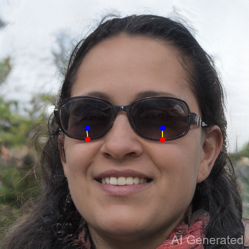
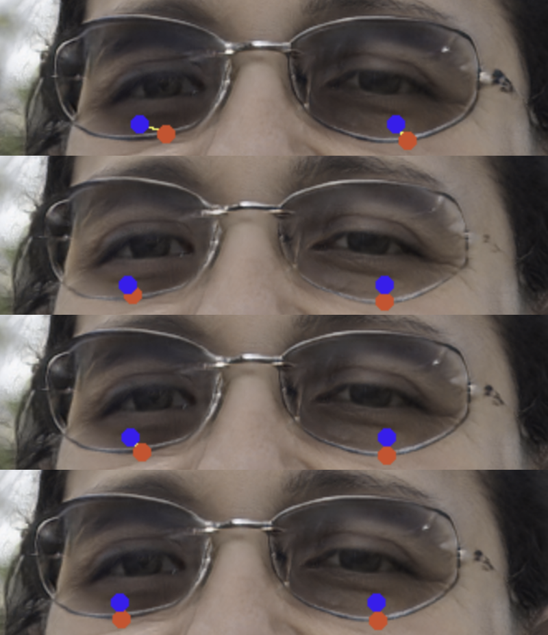
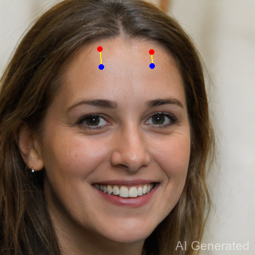
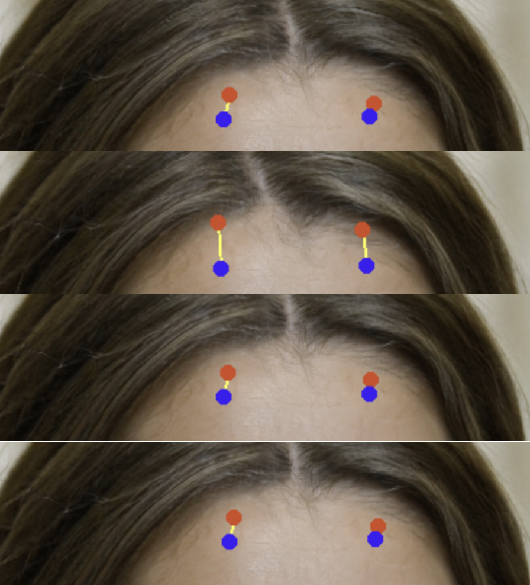

# Point Tracking Improvement Report

## 1. 引言 (Introduction)

DragGAN 的编辑可控性高度依赖于控制点的追踪精度。原始的最近邻（Nearest Neighbor, NN）追踪策略在处理弱纹理、长距离拖拽或重复纹理背景时往往表现出漂移现象。为了提升追踪的鲁棒性与准确性，我们设计并实现了多种改进的追踪方案，包括基于光流的 RAFT 追踪、光流引导的混合追踪（HYBRID）以及多尺度特征融合追踪（MULTISCALE）。本报告旨在通过定量实验评估这些方法在不同场景下的性能差异。

## 2. 方法论 (Methodology)

本次评测对比了四种不同的追踪配置。基线方法 **NN** 仅依赖单层特征的最近邻匹配。**RAFT** 方法利用预训练的大型光流模型直接估计点位移，适合纹理清晰的局部形变。**HYBRID** 方法采用光流预测作为先验引导，结合局部窗口内的特征匹配，通过超参数 `tracker_lambda` 平衡两者的权重，旨在结合光流的平滑性与特征匹配的语义一致性。**MULTISCALE** 方法则通过拼接多层特征图来增强特征的判别力，以应对纹理信息匮乏的挑战。

评估指标采用第 $k$ 步迭代时控制点与其目标位置之间的平均欧氏距离（Average Pixel Distance, APD）。在相同的初始条件（Seed、模型、特征点对）下，该距离越小，表明追踪器引导生成内容的收敛速度越快，或者在相同步数下能更准确地逼近目标状态。

## 3. 实验一：FFHQ 墨镜形状编辑 (Structured Texture)

本实验选取 FFHQ 人脸数据集中的样本，任务是将墨镜下沿向上拖拽以缩小镜片面积。该场景具有清晰的边缘结构与纹理信息，适合评估追踪器对显著特征的捕捉能力。实验设置迭代步数上限 $k=70$，并在达到该步数时记录所有控制点的平均像素距离。

### 3.1 定量结果

下表展示了四种方法在第 70 步时的平均像素距离。实验数据表明，各改进方法均优于基线 NN 方法。

| Tracker Type      | Average Pixel Distance (px) | 性能排序 (Rank) |
| :---------------- | :-------------------------: | :-------------: |
| **RAFT**          |          **8.69**           |        1        |
| **MULTISCALE**    |            10.55            |        2        |
| **HYBRID**        |            11.20            |        3        |
| **NN** (Baseline) |            14.65            |        4        |

### 3.2 结果分析

在该特定场景下，**RAFT** 取得了最优成绩（8.69 px），这主要归因于墨镜边缘具有极强的梯度信息，非常利于光流算法捕捉运动场。**MULTISCALE**（10.55 px）通过融合多层特征，比单层 NN 提升了约 28% 的精度，证明了增加特征维度对提升判别力的有效性。**HYBRID**（11.20 px）表现介于两者之间，但在该场景下受限于 `tracker_lambda` 的参数设定，未能完全发挥光流的优势。基线 **NN**（14.65 px）由于特征单一，收敛速度最慢，误差最大。

*(图a：实验初始状态)*

*(图b：四种方法第 70 步结果对比。从上至下依次为：NN, RAFT, HYBRID, MULTISCALE)*

## 4. 实验二：FFHQ 额头弱纹理编辑 (Weak Texture)

本实验旨在评估追踪算法在弱纹理区域的表现。选取 FFHQ 样本，任务是将人脸额头部位的点向下拖拽，视觉效果表现为发际线向下移动。额头区域皮肤光滑，缺乏显著的角点或边缘特征，是典型的弱纹理场景。实验设置迭代步数 $k=50$。

### 4.1 定量结果

下表展示了各方法在第 50 步时的平均像素距离。

| Tracker Type      | Average Pixel Distance (px) | 性能排序 (Rank) |
| :---------------- | :-------------------------: | :-------------: |
| **MULTISCALE**    |          **13.24**          |        1        |
| **NN** (Baseline) |            13.48            |        2        |
| **HYBRID**        |            13.66            |        3        |
| **RAFT**          |            28.43            |        4        |

### 4.2 结果分析

实验数据呈现出明显的两极分化。**RAFT** (28.43 px) 的误差显著高于其他方法（约两倍），证实了在缺乏结构性纹理时，光流算法极易遭受“孔径问题”困扰，导致严重的漂移或失效。

其余三种方法（**MULTISCALE**, **NN**, **HYBRID**）的终点误差非常接近（均在 13.2-13.7 px 之间），数值上无显著差异。然而，从定性的追踪过程观察来看，基线 **NN** 方法在迭代过程中表现出明显的“跳跃”现象，即控制点在相邻的相似特征间不稳定切换。相比之下，**MULTISCALE** 利用多层特征的语义约束，虽然最终距离提升有限，但过程更加平滑稳健。**HYBRID** 在此场景下受 RAFT 较大误差的（负面）引导影响，并未带来明显增益，表现主要依赖其最近邻组件的校正。

*(图a：实验初始状态)*

*(图b：四种方法第 70 步结果对比。从上至下依次为：NN, RAFT, HYBRID, MULTISCALE)*

## 5. 结论 (Conclusion)

综合两个实验场景的结果，表明没有单一的“银弹”追踪策略。追踪器的选择应高度依赖于编辑区域的纹理特征：

1.  **结构化场景优先光流**：在具有清晰边缘或丰富纹理的区域（如五官轮廓、配饰），**RAFT** 光流追踪展现出统治级的性能，能快速且高精度地锁定目标。
2.  **弱纹理场景慎用纯光流**：在皮肤、天空或平滑背景等弱纹理区域，纯光流方法（RAFT）存在极高的失效风险（漂移严重）。此时，**MULTISCALE** 提供了最佳的稳健性，它既避免了光流的失效，又比基线 NN 更加平滑稳定。
3.  **通用策略建议**：作为通用默认设置，**MULTISCALE** 是最安全的选择，它在所有场景下均能保持前二的性能，且无需加载额外的光流模型显存开销。若追求极致效果，建议实现基于纹理复杂度的**自适应切换策略**：在梯度显著区域自动激活 RAFT，而在平坦区域回退至 MULTISCALE。